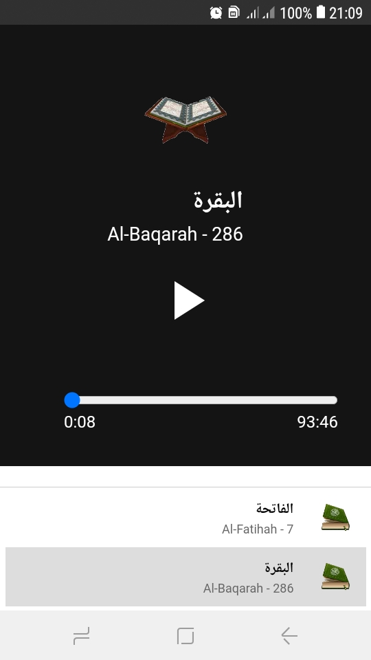
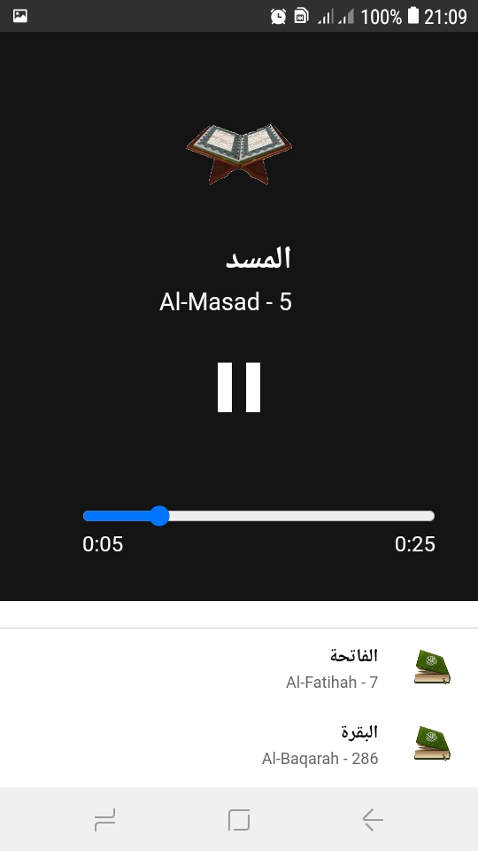
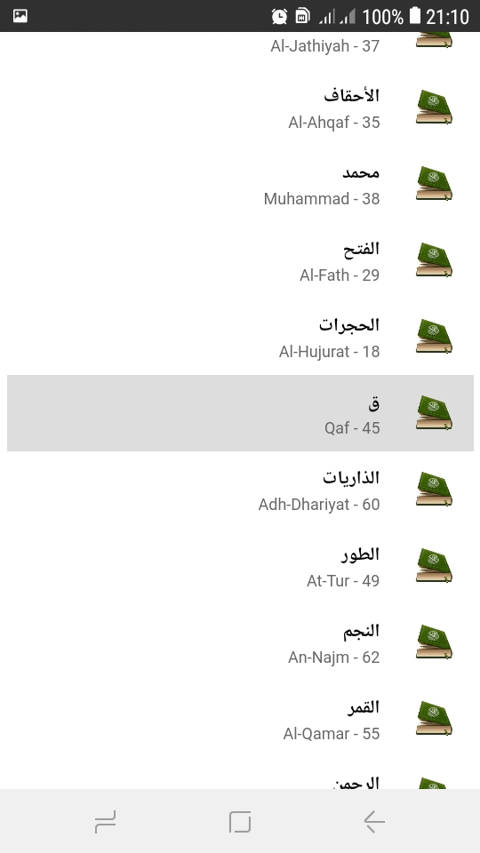

## Why
I was looking for an offline Quran application for my mother's old android in playstore but all offline apps are either full of ads or have low quality audio or can't run in here phone
So Using Chat-gpt and allot of debuginh i made this webpage and sent it to here phone and accessed it throw `file:///sdcard/Quranapp/index.html`

<table>
  <tr>
    <td>Player Paused</td>
    <td>Player Play</td>
    <td>List</td>
  </tr>
  <tr>
    <td></td>
    <td></td>
    <td></td>
 </tr>
</table>

## apk install
Using Some Free Web-to-apk services i made an apk for this , and using apktool i removed ads from it you can download the apk and use it
<a href="Quran.apk">Quran.apk</a>

### Steps to change reciter audio
#### the webpage html

Feel Free to clone this code and change the audio in `assets/audio/` to your preferrd reciter
#### APK File :
 1. unpack the apkfile
 `bash apktool d Quran.apk -r -o Quran`
 2. change audio in `Quran/assets/htmlapp/root/assets/audio/`
 3. pack and sign the apkfile
 `bash apktool b Quran -o Quran-build.apk -r`
 `bash apksigner sign --ks YOUR-KEY.keystore Quran-build.apk`

